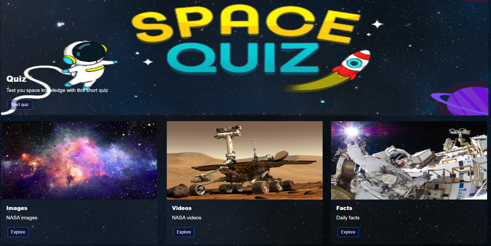

# SpaceOddysey

## Description:
SpaceOddysey is a simple and interactive app designed for space enthusiasts that want to discover more about space in a fun and engaging way, while avoiding information overload. The app contains various features including quizzes, images, videos and more!
Link to Deployed Application: https://nj-09.github.io/SpaceOddysey/

## Lessons learnt from this project:
- Use jQuery effects such as .hide and .show to hide and show elements as required
- Customisation of bootstrap components to override default styles - to make the app more unique and visually appealing 
- Findng relevant APIs, retireiving data and displaying it for the user
- Adding EventListeners and localStoarage to create responsive signup and login forms
- Using resourcs such as Pexel and removebg to find appropriate images and remove image background

## Usage:
In order to access the app, the user needs to register and login their details. The user can either user the navbar or scroll down to view the different sections of the app. The app contains a short timed quiz to test the users space knowledge, daily NASA images and videos and random space facts.

## Installation:
N/A

## Credits:
N/A

## License:
Please refer to the LICENSE in repository
